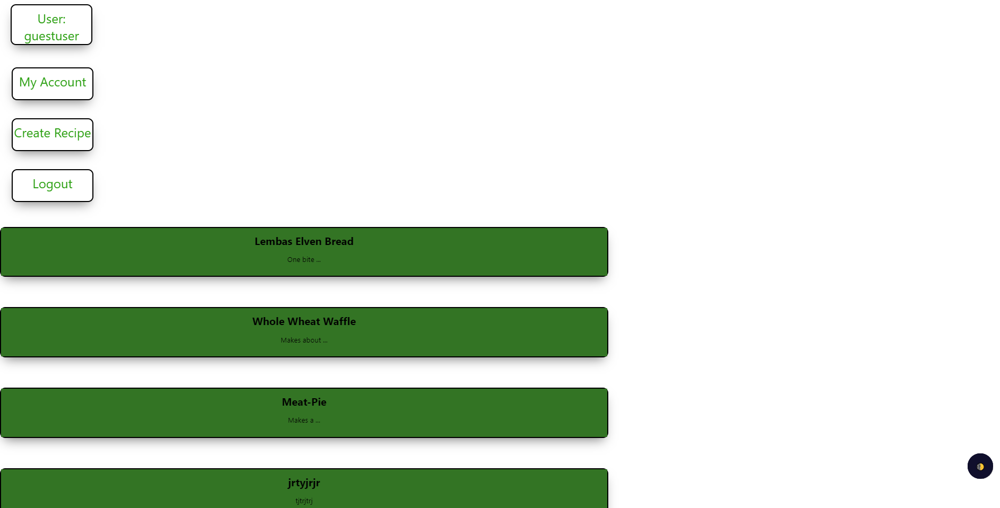

# kitchen-helper

## Visit Kitchen Helper:

  * [Server Side Repo](https://github.com/thinkful-ei-iguana/kitchen-helper-front-end)

  * [Live App](https://kitchen-helper-front-end.now.sh/)

## API Endpoints
  Recipe - Creating, editing, updating, deleting recipes. A recipe can be manipulated in any of these four ways by its creator, as a recipe is fetched the server checks to see whether the currently logged in person is the same as the user who created the recipe originally, with that confirmation all options are opened to the user, without that confirmation the recipe is functionally 'read only'.

  User - Logging in, making sure the recipe being added matches to your user id so nobody accidentally deletes someone elses recipes.
  The user endpoint is used primarily to assign recipes to each user on creation of a recipe. 

  Auth - Authorization, making sure that you are who you say you are and that no harm comes to the client or the server through malicious code or otherwise. The main purpose of the authentication endpoint is to make sure every user has a JWT (json web token), and that all data that traffics the server goes through a middleware program to discern any malicious code before it comes in contact with the server code itself.

  ## Screenshots:

   

   

      

   

   
   
   
   
   

## Summary
  Functionally this API Endpoints purpose is to allow for consistent tracking and holding of data inputed by the user. Recipes are maintained regardless of whether the window or session is shut down. It allows for the creating, reading, updating, and deleting of recipes as well as the creating of users. 

## Technologies:

**Front End Tech:** HTML, CSS, JavaScript, React, Widgets(Dark Mode)

**Back End Tech:** NodeJs, ExpressJs, PostgreSQL

**Testing Tech:** Jest, Supertest, Snapshot, Enzyme, Lodash, Mocha, Chai

## Core Features:

- Ability to create/login with user accounts

- Ability to display recipes, create new recipes

- Ability to edit and delete recipes

- Ability to display prep time and ingredients needed from the selected recipe

## Code Example:
  recipeRouter
  .route("/edit/:id")
  .patch(bodyParser, (req, res, next) => {
    try {
      const knexInstance = req.app.get("db");
      let { id } = req.params;
      id = parseInt(id);
      let { title, recipe_description, recipe_ingredients, time_to_make } = req.body;
      let updatedRecipe = { title, recipe_description, recipe_ingredients, time_to_make };
      let recipeId = req.body.id;

      const numberOfValues = Object.values(updatedRecipe).filter(Boolean).length;
      if (numberOfValues === 0) {
        return res.status(400).json({
          error: {
            message:
              "Request body must contain either 'title', 'recipe desription', 'recipe ingredients or 'time to make'"
          }
        });
      }
      recipeService
        .updateRecipe(knexInstance, id, updatedRecipe)
        .then(update => {
          res.status(204).end();
        })
        .catch(next);
    } catch (err) {
      console.log(err)
    }
  })